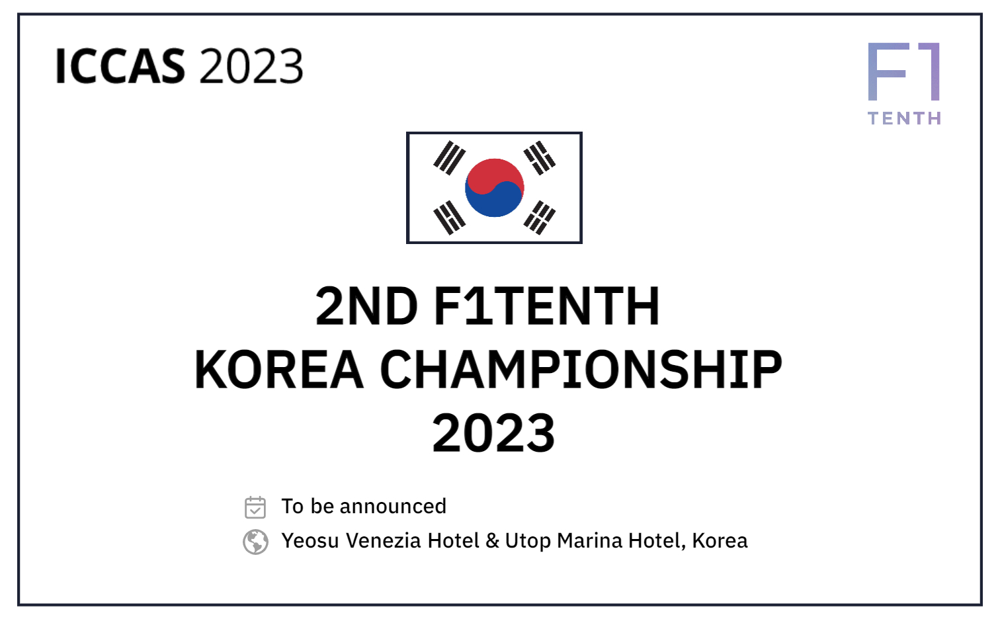

F1TENTH Autonomous Racing is a semi-regular competition organized by an international community of researchers, engineers, and autonomous systems enthusiasts.

 
 

The teams participating in 1st F1TENTH korea Championship will build a 1:10 scaled autonomous race car according to a given specification and write software for it to fulfill the objectives for the competition: Don’t crash and minimize laptime.
 
 
ICCAS 2024 is a In-person competition.
 
 
In-person competition: This variant targets participants who will travel to Jeju Island of the Republic of Korea . Each team will bring their own physical F1TENTH car with their software. The organizers provide the race setup (rules, submissions, guidelines), the track, related infrastructure and organize the race itself.
 

<!--  

 

 -->

